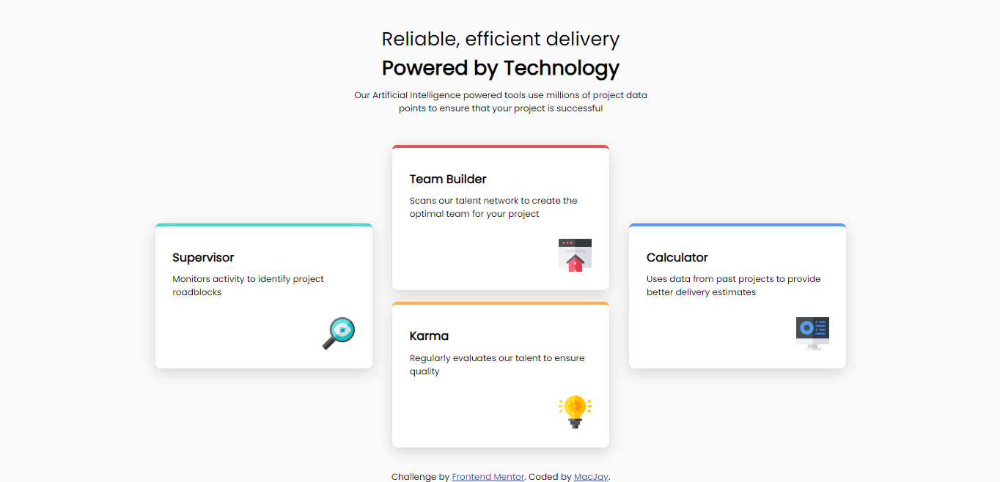

# Frontend Mentor - Four card feature section solution

This is a solution to the [Four card feature section challenge on Frontend Mentor](https://www.frontendmentor.io/challenges/four-card-feature-section-weK1eFYK). Frontend Mentor challenges help you improve your coding skills by building realistic projects.

## Table of contents

- [Overview](#overview)
  - [The challenge](#the-challenge)
  - [Screenshot](#screenshot)
  - [Links](#links)
- [My process](#my-process)
  - [Built with](#built-with)
  - [What I learned](#what-i-learned)
  - [Continued development](#continued-development)
  - [Useful resources](#useful-resources)
- [Author](#author)
- [Acknowledgments](#acknowledgments)

## Overview

### The challenge

Users should be able to:

- View the optimal layout for the site depending on their device's screen size

### Screenshot

- Desktop Screenshot




### Links

- [Live site URL here](https://macjay27.github.io/four-card-feature-section-master/)


## My process

### Built with

- Semantic HTML5 markup
- CSS custom properties
- Flexbox
- CSS Grid


### What I learned

- Using the CSS Grid Layout to position items across rows and columns in a way that is flexible and responsive.

```html
<div class="grid-container-1">
  <div class="grid-item-1">
    <h1><span>Reliable, efficient delivery</span></h1>
    <h1>Powered by Technology</h1>
  </div>
  <div class="grid-item-2">
    <h2>Our Artificial Intelligence powered tools use millions of project data points
    to ensure that your project is successful</h2>
  </div>
</div>
```
```css
.grid-container-1{
  display: grid;
  grid-template-columns: 25em;
  justify-content: center;
  padding: 2.5% 0 3% 0;
}
```
- Using Flexbox to lay out icons within a div tag.

```html
<div class="image">
  
</div>
```
```css
.image{
  display: flex;
  justify-content: flex-end;
  margin-top: 10%;
}
```


### Continued development

- CSS Box Shadows
- Absolute Positioning


### Useful resources

- [W3Schools](https://www.w3schools.com) - This helped me every step during the workflow lifecycle. I'd recommend any beginner looking to get quick and easy documentation from this site on all things web dev (front end).
- Code Ninja (YouTube)
- Kevin Powell (YouTube)


## Author
- Frontend Mentor - [@MacJay27](https://www.frontendmentor.io/profile/Macjay27)


## Acknowledgments
- [W3Schools](https://www.w3schools.com)
- Code Ninja (YouTube)
- Kevin Powell (YouTube)
